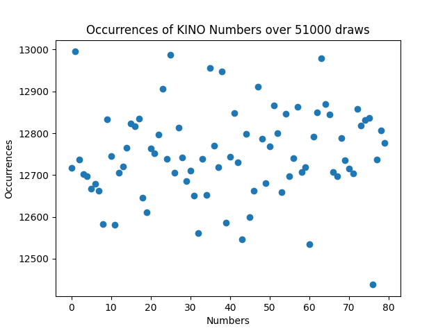
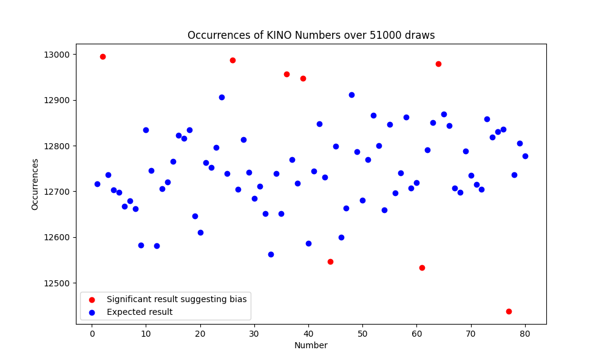
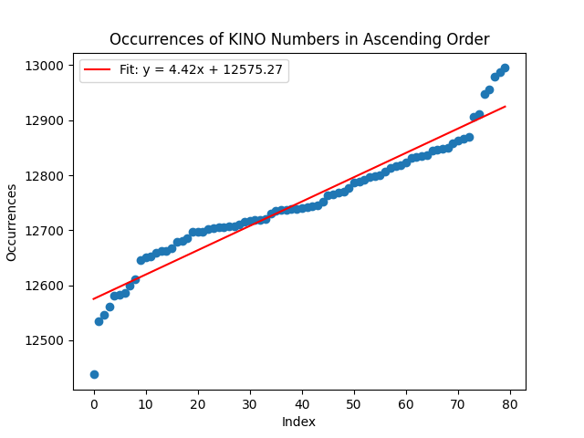

# KINO Data Analysis

This repository contains code and data for analyzing KINO game results to assess fairness. The analysis includes statistical testing and visualizations to determine if there is any bias in the occurrence of numbers.
The purpose of this project was to create a program 
that collects data from past KINO draws using an API
and then analyze it to test whether the draws are 
truly random.

## Data

The dataset `kinodata.db` is located in the `KINO_Data/` 
directory. It contains 51000 historical KINO draw results with 
numbers drawn in each game.

### Description

- **File:** `kinodata.db`
- **Content:** Historical draw results with space-separated
numbers

## Results

### Occurrences of KINO Numbers

The scatter plot below shows the number of occurrences of each 
KINO number over the 51000 draws selected. The data seems to fall within 
a range between 12438 and 12995. As there are quite a few deviations over
a relatively large sample size, further analysis was carried out in 
order to determine whether any were statistically significant, which would
suggest a biased game.

### Z-Test Analysis
A Z-Test analysis was performed, in order to test whether the probability
of each number occurring as calculated from the sample data deviates 
significantly from the expected probability given a truly random draw.

**Null Hypothesis, H0:** All numbers have an equal probability
of being drawn.
Mathematically, this can be expressed as:
- Each number from 1 to 80 has an equal probability of being drawn in any 
given draw
- The probability 𝑝 of any single number being drawn in a draw is 0.25
(since 20 numbers are drawn out of 80 total)

**Alternate Hypothesis, H1:** The KINO game is biased, and not 
all numbers have an equal probability of being drawn.

The probability of a number being drawn as calculated from the sample size
is given by 𝑝0 = occurrences/number of draws. The standard error
of the observed probability is e = sqrt(𝑝 * (1 - 𝑝) / n), where n = 51000. 
The z-statistic is then given by z = (𝑝-𝑝0)/n. 

A two-tailed test was performed at the 5% critical level, indicating bias
for numbers 2, 26, 36, 39, 44, 61, 64, 77. This result can be seen clearly
in the figure below:

### Linear Regression Analysis

A linear regression analysis was also performed to assess any bias in the 
number occurrences. The numbers were sorted by frequency of occurrence and 
line of best fit was calculated. The slope of the line was then tested to 
see if it deviated significantly from the expected value of zero. The plot 
can be seen below:

- **Slope (gradient):** 2.11
- **p-value:** 0.035

Since the p-value is less than the critical value of 0.05, the slope is 
significantly different from zero, suggesting a possible bias in the KINO 
game.

## Interpretation

**Bias present:** Both tests yielded results that were significant enough
to reject the null hypothesis and suggest a source of bias at the 5% confidence
level.

**Exploitation of the game:** Despite some numbers being more drawn than others,
it is not clear from this analysis whether this can be exploited for financial
gain. This can be for two reasons:
- **Recency of data**: The draw results used in this analysis might have been 
subject to a source of bias that is no longer present
- **Reward vs bias:** The bias might not be strong enough to compensate for 
the disadvantage that the player has by virtue of having a disproportionately 
lower reward relative to the player's probability of winning.

**Taking the analysis further:** Further steps to potentially improve the analysis 
could be:
- **Analyse different sets of data:** By looking at different sets of data and
performing the same analysis, we can see whether the same biases are present for 
the same set of numbers. This would indicate stronger possibilities of exploiting
the game.
- **Reward vs bias Analysis:** By looking at the rewards that the game offers, we
can come up with the minimum bias in the occurrence of certain numbers that would
allow us to build a winning strategy with positive expected profit.

